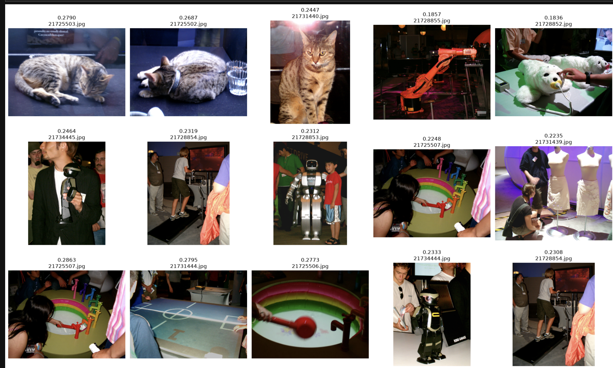

# Narrative Image Recommender

This project finds images that match a text story. It uses the VIST
dataset and the CLIP model. Currently it is in development and it only does photo selection (no ordering)

## Demo

This image shows an example run of the notebook.



The example uses album id `504823` from the VIST test dataset and these
three text queries:

- "cat going to sleep"
- "people posing for a photo"
- "a sunny day outside"

## Setup

This project uses `uv` to manage the Python environment.

1. Install `uv`. See <https://docs.astral.sh/uv/getting-started/installation/>.
2. Run this command to install the project and its dependencies:

```bash
uv sync --extra notebook --extra dev
```

## Get the Dataset

Download the VIST Story-in-Sequence dataset from this page:
<https://visionandlanguage.net/VIST/dataset.html>

Put the JSON files in the `sis` folder under `datasets`

## Generate the Data Models

Run this command to generate `models.py` from a dataset file:

```bash
uv run datamodel-codegen --input datasets/sis/test.story-in-sequence.json --input-file-type json --output models.py
```

This command reads the JSON file. It writes Python dataclasses for the data in
the file.

## Download the Images

Run this command to download the images for the dataset:

```bash
uv run download_images.py datasets/sis/test.story-in-sequence.json
```

Add the `--max-albums` flag to download images for only a few albums. Use
this flag for a fast test.

```bash
uv run download_images.py datasets/sis/test.story-in-sequence.json --max-albums 5
```

The images go in the `images` folder, in a subfolder for each album. Some
downloads fail, because some old links are dead. Check the file
`failed_downloads.log` for the list of failures - or don't, if even if some images
are missing it should be fine for a test.

## Run the Notebook

This project uses `marimo` for notebooks. A marimo notebook is a plain
Python file, so you can edit it in any text editor.

Run this command to open a notebook:

```bash
uv run marimo edit clip_recommend.py
```

## NOTE (!Important!)

Currently the project is in development.
The only explored part is photo selection via CLIP.

This repo will be used for further exploration and may diverge vastly from this initial step...
