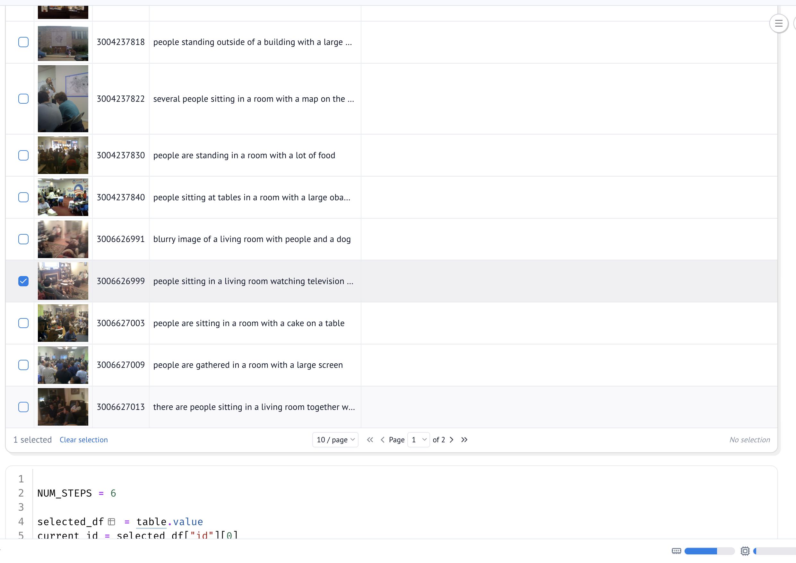
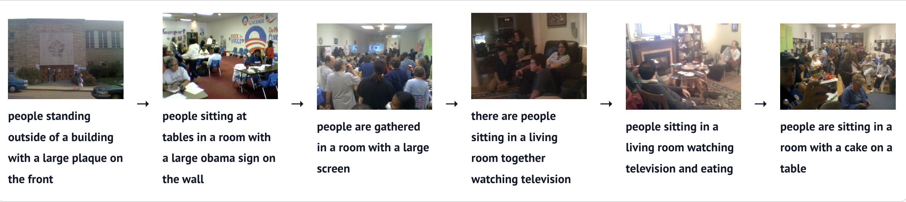
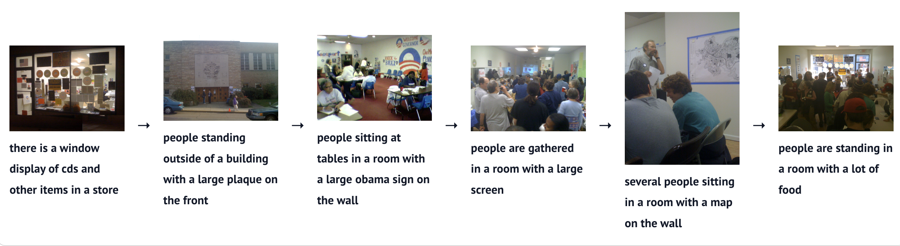

# Narrative Image Recommender

This project finds images that match a text story. It uses the VIST
dataset and the CLIP model. Currently it is in development and it only does photo selection (no ordering)

## Demo

This image shows an example run of the notebook.


The example uses album id `504823` from the VIST test dataset and these
three text queries:

- "cat going to sleep"
- "people posing for a photo"
- "a sunny day outside"

## Setup

This project uses `uv` to manage the Python environment.

1. Install `uv`. See <https://docs.astral.sh/uv/getting-started/installation/>.
2. Run this command to install the project and its dependencies:

```bash
uv sync --extra notebook --extra dev
```

## Get the Dataset

Download the VIST Story-in-Sequence dataset from this page:
<https://visionandlanguage.net/VIST/dataset.html>

Put the JSON files in the `sis` folder under `datasets`

## Generate the Data Models

Run this command to generate `models.py` from a dataset file:

```bash
uv run datamodel-codegen --input datasets/sis/test.story-in-sequence.json --input-file-type json --output models.py
```

This command reads the JSON file. It writes Python dataclasses for the data in
the file.

## Download the Images

Run this command to download the images for the dataset:

```bash
uv run download_images.py datasets/sis/test.story-in-sequence.json
```

Add the `--max-albums` flag to download images for only a few albums. Use
this flag for a fast test.

```bash
uv run download_images.py datasets/sis/test.story-in-sequence.json --max-albums 5
```

The images go in the `images` folder, in a subfolder for each album. Some
downloads fail, because some old links are dead. Check the file
`failed_downloads.log` for the list of failures - or don't, if even if some images
are missing it should be fine for a test.

## Get the YFCC-Cities Dataset

Download the YFCC100M-CITIES dataset from this page:
<https://hucvl.github.io/visual-storygraphs/>

Unzip the download. Put each city folder in the `datasets` folder. Each city
folder has one CSV file for each album.

## Download the YFCC-Cities Images

Run this command to download the images for one city:

```bash
uv run download_yfcc_images.py datasets/yfcmmf00m-cities-amsterdam
```

Add the `--max-albums` flag to download images for only a few albums. Use
this flag for a fast test.

```bash
uv run download_yfcc_images.py datasets/yfcmmf00m-cities-amsterdam --max-albums 5
```

The images go in the `images/yfcc` folder, in a subfolder for the city and a
subfolder for each album. Some downloads fail, because some old links are
dead. Check the file `failed_downloads.log` for the list of failures.

### Alternatively

Load the dataset via the loader function and it will download the images automatically that are missing.

## Run the Photo Selector Notebook

This project uses `marimo` for notebooks. A marimo notebook is a plain
Python file, so you can edit it in any text editor.

Run this command to open the notebook:

```bash
uv run marimo edit clip_selector.py
```

This notebook takes a text query. It uses CLIP to find the matching images in
an album.

## Run the Story Ordering Notebook

Run this command to open the notebook:

```bash
uv run marimo edit clip_llm_order.py
```

This notebook builds a photo story from an album. It uses BLIP to caption
each image, and a small local LLM (Qwen2.5-0.5B-Instruct) to write the story
one sentence at a time. After each sentence, it uses CLIP to find the closest
remaining image and adds it to the story.

Use the dataset picker at the top of the notebook to switch between the
YFCC-Cities Amsterdam album, a VIST album, and your own photos in
`datasets/personal-photos` (HEIC/JPG/PNG supported).

## Run the JEV Story Ordering Notebook

This notebook builds a photo story by asking a decision model to pick the
next photo, instead of generating free text and searching for the closest
image with CLIP. It uses `typesafe/jev-1.13` through OpenRouter's alpha
Decisions API: at each step, the model is given the story so far and the
remaining captions, and answers a single `choice` question — "which caption
should come next?"

### Setup

JEV runs through OpenRouter's API, there is no local model to train:

1. Get an API key from <https://openrouter.ai/keys>.
2. Put it in a `.env` file in the project root:

```bash
OPENROUTER_API_KEY=your-key-here
```

The notebook loads it with `python-dotenv`.

### Run

```bash
uv run marimo edit jev_caption_order.py
```

1. Pick a captioning model (`base-blip` or `large-blip`) — `large-blip`
   gives noticeably better captions.
2. In the table, select one image as the starting point of the story.
3. The notebook then loops: it asks JEV to pick the next caption from the
   images not yet used, appends it to the story, and repeats for
   `NUM_STEPS` images.

There is no training step. "Running" the notebook means calling the hosted
JEV model once per story step; the only local computation is BLIP
captioning.

### Examples

Selecting a starting image in the captioned table:



Two resulting story orderings from the same album, from two different
starting images, picked entirely by JEV from the BLIP captions:




### Findings

- Without a CLIP re-embedding step, the story is only as good as the
  captions: JEV can only pick between the captions it's given, so vague
  captions ("people sitting in a room") make its choices harder to tell
  apart.
- Both example runs above pick a plausible narrative order (building ->
  meeting room -> gathering -> watching TV -> cake), showing this approach
  works as an alternative to the LLM-generation-plus-CLIP-search pipeline
  in [Run the Story Ordering Notebook](#run-the-story-ordering-notebook).

## NOTE (!Important!)

Currently the project is in development.
The only explored parts are photo selection via CLIP, story ordering via
CLIP, BLIP, and a small LLM, and story ordering via BLIP captions and the
JEV decision model.

This repo will be used for further exploration and may diverge vastly from this initial step...
