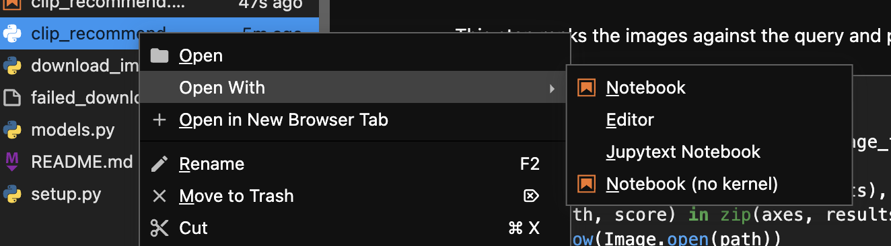

# Narrative Image Recommender

This project finds images that match a text story. It uses the VIST
dataset and the CLIP model.

## Setup

Do these steps in order.

1. Create a virtual environment.
2. Activate the virtual environment.
3. Install the project.

```bash
python3 -m venv .venv
source .venv/bin/activate
pip install -e ".[notebook,dev]"
```

## Get the Dataset

Download the VIST Story-in-Sequence dataset from this page:
<https://visionandlanguage.net/VIST/dataset.html>

Put the JSON files in the `sis` folder.

## Generate the Data Models

Run this command to generate `models.py` from a dataset file:

```bash
datamodel-codegen --input sis/test.story-in-sequence.json --input-file-type json --output models.py
```

This command reads the JSON file. It writes Python dataclasses for the data in
the file.

## Download the Images

Run this command to download the images for the dataset:

```bash
python3 download_images.py sis/test.story-in-sequence.json
```

Add the `--max-albums` flag to download images for only a few albums. Use
this flag for a fast test.

```bash
python3 download_images.py sis/test.story-in-sequence.json --max-albums 5
```

The images go in the `images` folder, in a subfolder for each album. Some
downloads fail, because some old links are dead. Check the file
`failed_downloads.log` for the list of failures - or don't, if even if some images
are missing it should be fine for a test.

## Run the Notebook

Open the notebook file in Jupyter Lab:

```bash
jupyter lab
```

The project uses "jupytext" to convert plaintext notebooks to Jupyter.
This allows you to edit the notebooks in your favourite text editor while
still being able to run them in Jupyter.



## NOTE (!Important!)

Currently the project is in development.
The only explored part is photo selection via CLIP.

This repo will be used for further exploration and may diverge vastly from this initial step...
